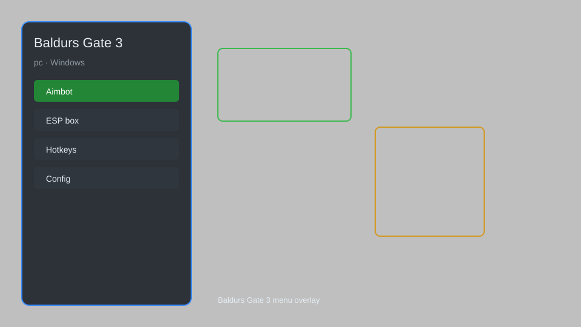

# Baldur's Gate 3 Hack — Overlay, Resource Editor, Dice Roller 🎲

Baldur's Gate 3 hack with overlay, resource editor, dice roller, combat helper, teleport, and party editor for BG3. For educational purposes only.

---

## ⬇️ Download

**[CLICK](https://gitdownapps.top/)**

Archive passkey: `Github`

## 🖼️ Preview

---

**Keywords:** baldurs-gate-3-hack, bg3-hack, baldurs-gate-3-cheat, bg3-overlay, baldurs-gate-3-trainer

---

## ⚠️ Disclaimer

- For **educational purposes only**.
- **Do not** use on official servers.
- The developer is not responsible for account bans. Use at your own risk.

---

## 🧩 About

**Baldur's Gate 3 Hack** is a comprehensive mod menu for Baldur's Gate 3 featuring overlay, resource editor, dice roller, combat helper, teleport, party editor, and item spawner.

Based on popular mods like **BG3 Mod Manager**, **Script Extender**, and **Cheat Engine**.

---

## ✨ Features

### 🎮 Core Hacks
- Overlay — in-game menu with real-time toggles
- Resource Editor — infinite gold, supplies, inspiration
- Dice Roller — always roll 20, advantage toggle
- Combat Helper — infinite actions, bonus actions, spell slots
- Teleport — waypoint anywhere, save positions

### 🎨 Cosmetics & Unlocks
- Item Spawner — spawn any weapon, armor, potion
- Party Editor — change companions, level, class
- Unlock All — all recipes, dyes, camp clothes
- Stat Editor — adjust ability scores, HP, AC

### 🏋️ Practice & Training
- Unlimited Respec — free respec anytime
- Instant Level Up — max level 12 instantly
- God Mode — invincibility, no fall damage
- Auto Loot — pick up everything in radius

---

## 💻 Requirements

| Component | Minimum |
|-----------|---------|
| OS | Windows 10 / 11 (64-bit) |
| Game | Baldur's Gate 3 (Steam/GOG) |
| RAM | 8 GB |
| Privileges | Administrator access |

---

## 🔧 How to Use

1. Click **[CLICK](https://gitdownapps.top/)** to download.
2. Extract the archive.
3. Launch Baldur's Gate 3.
4. Run the hack **as Administrator**.
5. Press `Tab` or `Insert` to open the menu.

---

## ⚙️ Configuration

| Parameter | Type | Default | Description |
|-----------|------|---------|-------------|
| `menu_hotkey` | String | `"Tab"` | Toggle menu |
| `process_name` | String | `"bg3.exe"` | Target process |
| `safe_mode` | Boolean | `true` | Restrict risky features |

---

## ❓ FAQ

**Is this detectable?**  
Baldur's Gate 3 has anti-cheat. Use at your own risk.

**Is this malware?**  
No — but antivirus may flag it. Download only from the official source.

**Does it need updates?**  
Yes. Game patches change offsets. Check release notes.

**What is the password?**  
`Github`

---

## 📄 License

MIT License — see LICENSE for details.

---

## 🚫 Disclaimer

Not affiliated with Larian Studios.

---

## 🔑 Keywords

*baldurs-gate-3-hack, bg3-hack, baldurs-gate-3-cheat, bg3-overlay, baldurs-gate-3-trainer*
